## 👋 Hi, I’m Atlas

### AI/ML Systems Engineer · Agent & LLM

I build machine-learning systems that connect models with real tools, data contracts, evaluation loops, and reproducible engineering workflows.

<table>
<tr>
<td width="50%">

**What I work on**

<code>Agent systems</code> <code>LLM post-training</code> <code>NL2SQL</code> 
<code>Document AI</code> <code>Data pipelines</code> <code>Evaluation</code>

</td>
<td width="50%">

**What I care about**

Clear interfaces · deterministic guards 
Leakage-safe evaluation · honest conclusions

</td>
</tr>
</table>

## ✨ Selected work

<table>
<tr>
<td width="50%" valign="top">

### 🛒 [Shopping Agent Post-training](https://github.com/Josepheeeee/shopping-agent-posttraining)

LoRA SFT + veRL GRPO for long-horizon shopping agents that must search, verify, select variants, and purchase.

<strong>Highlight:</strong> Baseline 1.0% → SFT 57.0%; GRPO 58.5%, with the current SFT→GRPO gain not statistically significant.

</td>
<td width="50%" valign="top">

### 🧩 [DeepVision NL2SQL](https://github.com/Josepheeeee/deepvision-nl2sql)

Stateful natural-language querying with table routing, schema-aware semantic parsing, constrained DSL, deterministic SQL compilation, and read-only MCP tools.

<strong>Highlight:</strong> LLM handles semantic mapping; code owns SQL structure and safety boundaries.

</td>
</tr>
<tr>
<td width="50%" valign="top">

### 📄 [AFAC Document Repair](https://github.com/Josepheeeee/afac-document-repair)

Conservative financial-table structure repair using directional morphology, line detection, chunk-aware processing, and regression checks.

<strong>Highlight:</strong> Team result: B-rank #7; my focus was table-header repair and regression coverage.

</td>
<td width="50%" valign="top">

### 📊 [Seagate Fail Monitor](https://github.com/Josepheeeee/seagate-fail-monitor)

A local, synthetic-data reproduction of a manufacturing quality-monitoring workflow from source tables to dashboard, alert outbox, and traceable results.

<strong>Highlight:</strong> Runnable backend + frontend demo with deterministic failure injection and recovery paths.

</td>
</tr>
</table>

## 🧰 Toolbox

  
  
  
  
  
  
  
  

## 🧭 How I build

~~~text
question → explicit data contract → small reproducible run
        → deterministic checks → paired evaluation → honest conclusion
~~~

I prefer a useful limitation over an impressive but unsupported claim. Each project README includes the current implementation boundary and the fastest path for a technical reader to reproduce or inspect it.

  Thanks for stopping by · Explore the repositories or start a conversation on GitHub.

