<a href="./README.md">English</a> · <strong>简体中文</strong>

## 👋 你好，我是 Atlas

### AI/ML 系统工程师 · Agent 与 LLM

我专注于构建能够连接真实工具、数据契约与评测闭环的机器学习系统，并重视工程流程的可复现性。

<table>
<tr>
<td width="50%">

**我的技术方向**

<code>Agent 系统</code> <code>LLM 后训练</code> <code>NL2SQL</code> 
<code>文档智能</code> <code>数据流水线</code> <code>模型评测</code>

</td>
<td width="50%">

**我的工程原则**

清晰的接口 · 确定性的安全边界 
避免数据泄漏的评测 · 如实呈现结论

</td>
</tr>
</table>

## ✨ 代表项目

<table>
<tr>
<td width="50%" valign="top">

### 🛒 [Shopping Agent Post-training](https://github.com/Josepheeeee/shopping-agent-posttraining)

面向长程购物 Agent 的 LoRA SFT 与 veRL GRPO 后训练方案，覆盖搜索、信息核验、规格选择与购买等连续决策环节。

<strong>关键结果：</strong> Baseline 1.0% → SFT 57.0%；GRPO 达到 58.5%，但当前 SFT→GRPO 的增益尚未达到统计显著。

</td>
<td width="50%" valign="top">

### 🧩 [DeepVision NL2SQL](https://github.com/Josepheeeee/deepvision-nl2sql)

有状态的自然语言查询系统，包含数据表路由、Schema 感知语义解析、受约束 DSL、确定性 SQL 编译以及只读 MCP 工具。

<strong>技术特点：</strong> LLM 负责语义映射，代码负责 SQL 结构与安全边界。

</td>
</tr>
<tr>
<td width="50%" valign="top">

### 📄 [AFAC Document Repair](https://github.com/Josepheeeee/afac-document-repair)

面向复杂金融表格的保守式结构修复方案，结合方向性形态学、线段检测、分块处理与回归检查。

<strong>项目结果：</strong> 团队 B 榜第 7；我主要负责表头结构修复与回归测试覆盖。

</td>
<td width="50%" valign="top">

### 📊 [Seagate Fail Monitor](https://github.com/Josepheeeee/seagate-fail-monitor)

基于合成数据的本地制造质量监控流程复现，从源数据表延伸至监控面板、告警发件箱与可追溯结果。

<strong>技术特点：</strong> 提供可运行的前后端演示，包含确定性故障注入与恢复路径。

</td>
</tr>
</table>

## 🧰 工具栈

  
  
  
  
  
  
  
  

## 🧭 我的工程方法

~~~text
问题定义 → 明确数据契约 → 小规模可复现实验
        → 确定性检查 → 配对评测 → 如实结论
~~~

我更愿意保留一个有用且明确的限制，也不会给出看似亮眼但缺乏证据的结论。每个项目 README 都说明了当前实现边界，并为技术读者提供了最快的复现或检查路径。

  感谢访问 · 欢迎浏览项目仓库，或通过 GitHub 与我交流。

